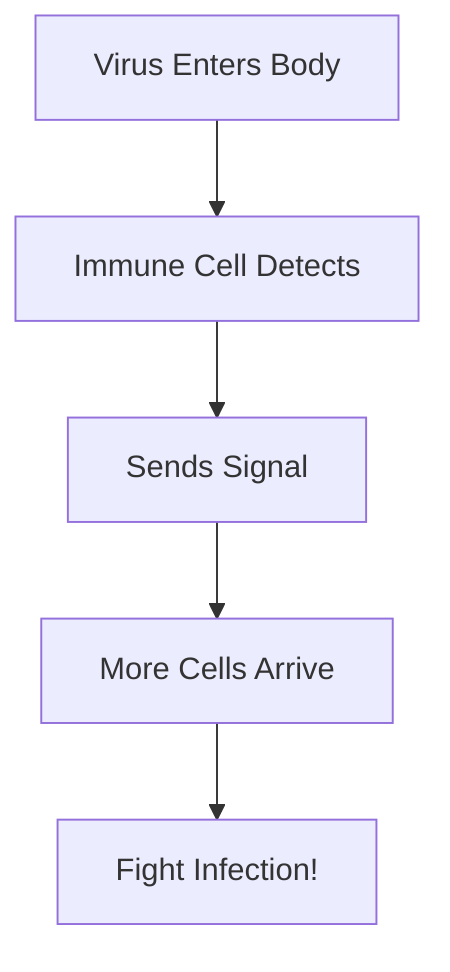

# 🔬 ScienceSheetForge

**Automated Science Worksheet Generator for K-8 Education**

Create engaging, educational science worksheets for Teachers Pay Teachers using Cell Collective and ModelIt K12 concepts - powered by FREE APIs!

---

## 🎯 Project Overview

ScienceSheetForge helps educators automate the creation of fun, interactive science worksheets for elementary and middle school students (K-8). Focus on biological systems, cell biology, and systems thinking using proven educational frameworks like Cell Collective and ModelIt K12.

---

## 🎨 20 Fun Worksheet Ideas

### Interactive & Story-Based Worksheets

1. **"Cell City" Map Building** - Students design a city where each building represents an organelle (post office = Golgi, power plant = mitochondria)

2. **"Disease Detective" Mystery Cases** - Solve what's wrong with the patient by following clues through the body's systems

3. **"Super Cell Heroes" Trading Cards** - Create collector cards for different cell types with their "superpowers" and special abilities

4. **"Message Relay Race" Comics** - Draw or complete comic strips showing how cells send messages to each other

5. **"Body Balance Challenge" Game Boards** - Navigate a game board showing how the body fixes problems (too hot, too cold, hungry, etc.)

6. **"Build-a-Creature" Design Sheets** - Create imaginary creatures and predict what they need to survive in different environments

7. **"Cell Phone Conversations"** - Fill in the dialogue bubbles: What would cells say to each other? (immune cells calling for backup!)

8. **"Science Superhero Origin Stories"** - How did White Blood Cell Woman get her powers? Write about immune system defenders

9. **"Germ Invasion" Battle Maps** - Strategic game showing how the body fights off invaders with different defense systems

10. **"What Happens Next?" Prediction Puzzles** - Flip-card style: show a scenario, predict the outcome, check your answer!

### Systems Thinking & Modeling Worksheets

11. **"Cell Factory Assembly Line"** - Follow the protein-making process like a factory tour with fun jobs at each station

12. **"Emoji Reactions"** - Match cell responses to situations using emojis (😰 stress, 💪 growth, 🔥 inflammation)

13. **"Choose Your Own Adventure" Scenarios** - "You are a red blood cell... do you go to the lungs or the heart? Choose wisely!"

14. **"Model Scientist Challenge Cards"** - "Can you predict what happens if...?" with wild scenarios to test their thinking

15. **"Systems Thinking Story Maps"** - Illustrated story chains: "The sun shines → plants grow → rabbits eat → foxes hunt → ..."

16. **"Before & After" Comparison Puzzles** - What does a healthy cell look like vs. a sick cell? Spot the differences!

17. **"Signal Scavenger Hunt"** - Follow the clues through the pathway to discover the secret message cells are sending

18. **"Feedback Loop Roller Coasters"** - Positive loops go UP, negative loops bring you back DOWN - visualize with fun graphics

19. **"Virtual Lab Experiment Designer"** - Students design their own experiments with mad scientist lab equipment illustrations

20. **"Cell Olympics Competition"** - Which organelle wins at different events? (Mitochondria wins marathon, nucleus wins brain games!)

---

## 🆓 Free APIs for Worksheet Creation

### 📊 1. QuickChart - Charts & Graphs
**Best For:** Data visualization, graphs, scientific charts

- **URL:** https://quickchart.io
- **What it does:** Creates beautiful charts from URLs, no watermarks
- **Rate Limit:** 120 requests/minute (FREE!)
- **Commercial Use:** ✅ Yes

**Example:**
```
https://quickchart.io/chart?c={type:'bar',data:{labels:['Q1','Q2','Q3','Q4'],datasets:[{label:'Revenue',data:[50,60,70,180]}]}}
```

### 🎨 2. Kroki - Diagrams & Flowcharts
**Best For:** System diagrams, biological pathways, feedback loops

- **URL:** https://kroki.io
- **What it does:** Creates diagrams from text descriptions (Mermaid, PlantUML, GraphViz)
- **Rate Limit:** Unlimited
- **Commercial Use:** ✅ Yes
- **Output Formats:** SVG, PNG, PDF

**Example Mermaid Diagram:**


### 👤 3. DiceBear - Character Avatars
**Best For:** Fun characters, student avatars, cell heroes

- **URL:** https://www.dicebear.com
- **What it does:** Generates unique characters from text seeds
- **Rate Limit:** 50 requests/sec for SVG
- **Commercial Use:** ⚠️ Non-commercial (requires self-hosting for commercial)
- **Styles:** adventurer, avataaars, bottts, fun-emoji, lorelei, micah, open-peeps, pixel-art

**Example:**
```
https://api.dicebear.com/9.x/adventurer/svg?seed=CellHero1
https://api.dicebear.com/9.x/pixel-art/svg?seed=WhiteBloodCell
```

### 🖼️ 4. Unsplash API - Educational Photos
**Best For:** Real photos (cells, nature, science equipment)

- **URL:** https://unsplash.com/developers
- **What it does:** 3+ million high-quality photos
- **Rate Limit:** 50 requests/hour (demo mode)
- **Commercial Use:** ✅ Yes (attribution required)

### 📸 5. Pexels API - Stock Photos & Videos
**Best For:** Educational images, nature, science

- **URL:** https://www.pexels.com/api
- **What it does:** 1+ million free photos and videos
- **Rate Limit:** Unlimited (reasonable use)
- **Commercial Use:** ✅ Yes (no attribution required)

### 🎭 6. OpenClipart - SVG Clipart
**Best For:** Educational clipart, icons, illustrations

- **URL:** https://openclipart.org
- **What it does:** 180,000+ free SVG graphics
- **Rate Limit:** Unlimited
- **Commercial Use:** ✅ Yes (public domain)

### 🎨 7. SVG Repo - Free SVG Icons
**Best For:** Simple icons and symbols

- **URL:** https://www.svgrepo.com
- **What it does:** 500,000+ free SVG icons
- **Commercial Use:** ✅ Yes

---

## 🚀 How to Use This Project

### Prerequisites

```bash
# Python 3.8+
python --version

# Install dependencies
pip install requests pillow
```

### Quick Start

1. **Clone this repository**
```bash
git clone https://github.com/YOUR_USERNAME/ScienceSheetForge.git
cd ScienceSheetForge
```

2. **Run a sample worksheet generator**
```bash
python examples/cell_hero_worksheet.py
```

3. **Customize for your needs**
- Edit templates in `/templates`
- Modify content in `/content`
- Adjust settings in `config.py`

---

## 📁 Project Structure

```
ScienceSheetForge/
├── README.md                  # This file
├── LICENSE                    # MIT License
├── requirements.txt           # Python dependencies
├── config.py                  # Configuration settings
│
├── examples/                  # Example worksheet generators
│   ├── cell_hero_worksheet.py
│   ├── disease_detective.py
│   └── feedback_loop_game.py
│
├── generators/               # Core generation modules
│   ├── diagram_generator.py  # Kroki integration
│   ├── chart_generator.py    # QuickChart integration
│   ├── character_generator.py # DiceBear integration
│   └── worksheet_builder.py  # PDF assembly
│
├── content/                  # Content libraries
│   ├── cell_heroes.json      # Character names and powers
│   ├── diseases.json         # Disease scenarios
│   ├── questions.json        # Question banks by grade
│   └── scenarios.json        # Story scenarios
│
├── templates/                # Worksheet templates
│   └── base_template.py      # Base worksheet layout
│
└── docs/                     # Documentation
    ├── API_GUIDE.md          # API integration guide
    ├── CANVA_INTEGRATION.md  # Canva API setup
    └── TEACHERS_PAY_TEACHERS.md # TPT selling tips
```

---

## 💡 Fun Elements to Engage Students

### Visual Appeal
- 🎨 Bright colors and cartoon characters
- 🦸 Superhero-themed cell defenders
- 🎮 Game-like layouts and point systems
- 🏆 Achievement badges and stickers
- 🌈 Rainbow color-coding for different systems

### Interactive Features
- ✂️ Cut-and-paste activities
- 🎲 Dice rolling for random scenarios
- 🃏 Card matching games
- 🧩 Jigsaw puzzle pieces to assemble
- 🔍 Hidden pictures and codes to discover

### Story-Based Learning
- 📚 Adventure narratives with characters
- 🗺️ Journey through the body maps
- 🕵️ Mystery-solving missions
- 🎭 Role-playing scenarios
- 💭 Comic strip formats

---

## 🎓 Educational Frameworks

### Cell Collective Integration
- Reference their educational models
- Create pre/post-simulation worksheets
- Use publicly available pathway data
- Design complementary activities

### ModelIt K12 Principles
- Systems thinking
- Cause and effect relationships
- Feedback loops
- Model validation
- Hypothesis testing

---

## 🔄 Automation Workflow

### What to Automate
- ✅ Character randomization (different superhero cells each time)
- ✅ Story scenario variations (different diseases, different adventures)
- ✅ Difficulty levels (K-2 vs. 3-5 vs. 6-8)
- ✅ Name personalization ("Detective [Student Name] investigates...")
- ✅ Random challenge cards
- ✅ Different creature combinations
- ✅ Varied maps and pathways

### Generation Pipeline
```
Step 1: Generate Graphics
├─ Kroki API → Diagrams, flowcharts
├─ QuickChart → Charts and graphs
├─ DiceBear → Character avatars
└─ Pexels → Real photos (optional)

Step 2: Combine Elements
├─ Python PIL → Layout composition
├─ Add text, questions, branding
└─ Generate answer keys

Step 3: Export
├─ PDF for printing
├─ PNG for digital use
└─ Upload to Teachers Pay Teachers
```

---

## 💰 Cost Analysis

| Component | Cost | Notes |
|-----------|------|-------|
| **QuickChart** | $0/month | 120 req/min free |
| **Kroki** | $0/month | Unlimited, self-hostable |
| **DiceBear** | $0/month | Self-host for commercial use |
| **Pexels** | $0/month | Unlimited reasonable use |
| **Unsplash** | $0/month | 50/hour demo mode |
| **OpenClipart** | $0/month | Public domain |
| **Python/PIL** | $0/month | Open source |
| **Total** | **$0/month** | 🎉 Completely FREE! |

---

## 📜 License

This project is licensed under the MIT License - see the [LICENSE](LICENSE) file for details.

---

## 🤝 Contributing

Contributions are welcome! Please feel free to submit a Pull Request.

1. Fork the repository
2. Create your feature branch (`git checkout -b feature/AmazingFeature`)
3. Commit your changes (`git commit -m 'Add some AmazingFeature'`)
4. Push to the branch (`git push origin feature/AmazingFeature`)
5. Open a Pull Request

---

## 🌟 Acknowledgments

- **Cell Collective** - For educational biology models
- **ModelIt K12** - For systems thinking framework
- **QuickChart** - Chart generation API
- **Kroki** - Diagram generation service
- **DiceBear** - Avatar library
- **Pexels & Unsplash** - Free photo APIs
- **OpenClipart** - Public domain clipart

---

## 📞 Contact & Support

- **Issues:** [GitHub Issues](https://github.com/YOUR_USERNAME/ScienceSheetForge/issues)
- **Discussions:** [GitHub Discussions](https://github.com/YOUR_USERNAME/ScienceSheetForge/discussions)

---

## 🎯 Roadmap

- [ ] Basic worksheet generators for all 20 worksheet types
- [ ] Canva API integration
- [ ] Batch generation tool (create 50 worksheets at once)
- [ ] Grade level difficulty adjustment
- [ ] Spanish language support
- [ ] Answer key auto-generation
- [ ] Teachers Pay Teachers optimization guide
- [ ] Video tutorials
- [ ] Community template library

---

**Made with ❤️ for educators who want to inspire the next generation of scientists!**

🧬 Happy Teaching! 🔬
